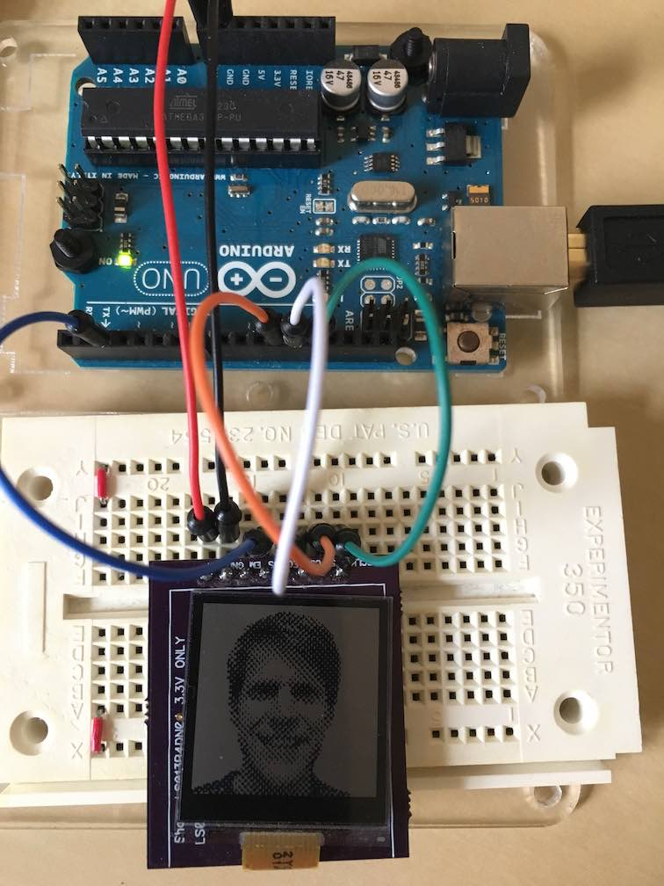

Sharp Memory LCD for Arduino
============================

This code allows you to write text, draw shapes, and pictures to the Sharp Memory LCD.

It uses the [Adafruit_GFX](https://github.com/adafruit/Adafruit-GFX-Library) and has been tested with version dc40877.

For creating halftone images, see [halftone2src](https://github.com/cskeeters/halftone2src).

Installation
------------

    mkdir -p ~/Documents/Arduino/libraries
    cd ~/Documents/Arduino/libraries
    git clone https://github.com/adafruit/Adafruit-GFX-Library
    git clone https://github.com/cskeeters/SharpMemoryLcd
    git clone https://github.com/cskeeters/SharpMemoryLcdSampleImages

    mkdir -p ~/Documents/Arduino/SharpMemoryLcdTest
    cp SharpMemoryLcd/test/SharpMemoryLcdTest.ino ~/Documents/Arduino/SharpMemoryLcdTest

Then just open SharpMemoryLcdTest/SharpMemoryLcdTest.ino with the Arduino SDK, compile, and upload.

Wiring
------

I tested this with the [breakout board from kuzyatech](http://kuzyatech.com/tag/sharp-memory-lcd) that costs $16.

I followed his wiring suggestions:

Arduino | Breakout Board Pin
--------|-------------------
Vin     | Vin
GND     | GN
2       | DISP (DS)
11      | SI
12      | SCS (CS)
13      | SCLK

None of the other pins on the breakout board need to be connected.

Demo
----

